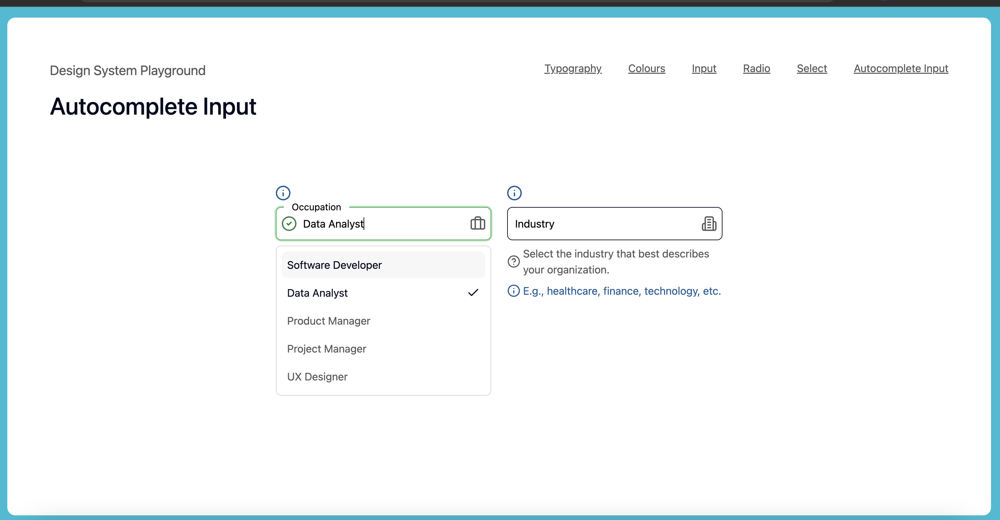
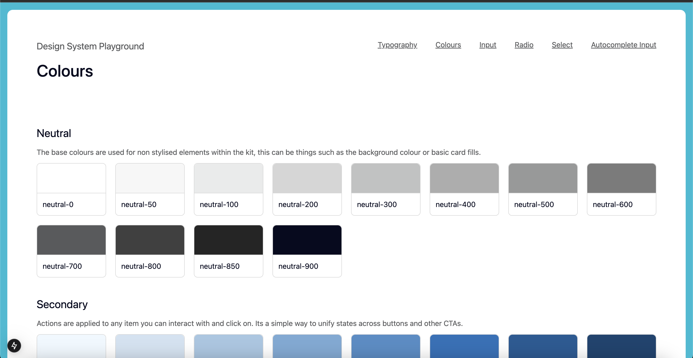
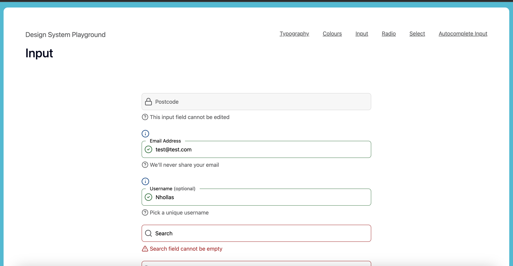
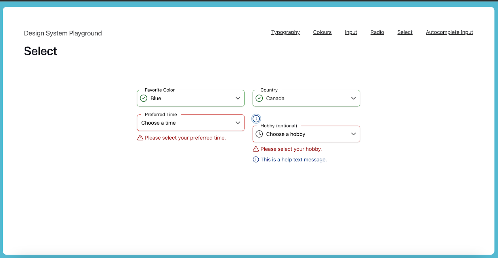
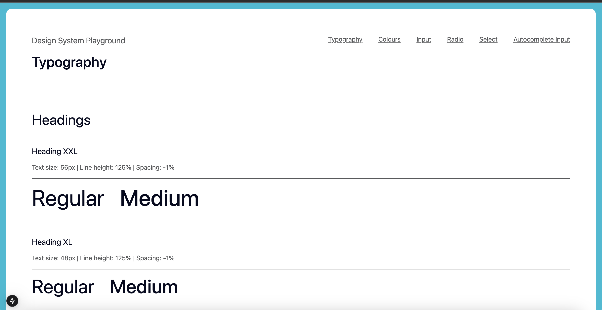

# Design System Playground

## About

This repository demonstrates how you can build a design system that ensures consistent UI, reusable components, styling guidelines, and has accessibility at its core.

## Setup

Clone this repository and install dependencies:

```bash
git clone https://github.com/Nhollas/design-system-playground.git
cd design-system-playground
npm install
```

To start the development environment:

```bash
npm run dev
```

## Contributing

Open an issue or submit a pull request for any improvements or bug fixes. Contributions are welcome!

## Tools

- **[Tailwindcss V4](https://tailwindcss.com/docs/v4-beta)**: Provides utility-first styling across UI components.
- **[React Aria Components](https://react-spectrum.adobe.com/react-aria/components.html)**: Helps with accessible interaction patterns and behaviors.
- **[React Hook Form](https://react-hook-form.com/)**: Handles complex form states and validations.
- **[Zod](https://zod.dev/)**: Ensures robust schema validation for form data.
- **[Tanstack Query](https://tanstack.com/query/latest)**: Manages server-state, caching, and data fetching logic.

## Showcase

Here are some screenshots of the app in its current state:






